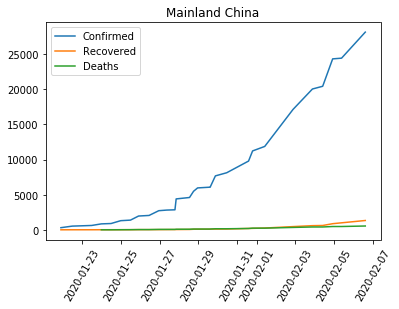
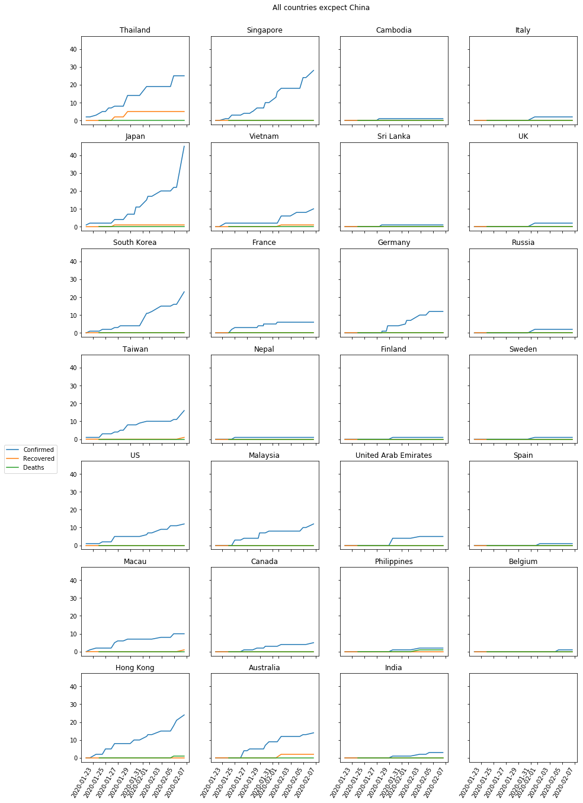

# Coronavirus 2019-nCoV

I made this program just for practice. It uses python and Google Spreadsheets API. I got data from: https://gisanddata.maps.arcgis.com/apps/opsdashboard/index.html?fbclid=IwAR3S1IMXpzD-EfOPqWCDttt96vuDQ77Uddrqhhf-iTRmYKxyOPQlPhsxG14#/bda7594740fd40299423467b48e9ecf6, provided by JHU CSSE.

Today (5.02.2020) they changed link to spreadsheet and also added new one with timeseries.
I've made some changes:
- initially I have been doing this project in pycharm (to learn using pycharm) but I decided to move to **jupyter notebook**
- when I have been using pycharm I also used it's git component but now I will be using **git bash**
- created new repo and deleted old one but I kept code in python file

**Things i plan to do:**
- [x] Open google spreadsheet from url using **oauth2** and **gspread**
- [x] Get data from google spreadsheet with **gspread** and **gspread_dataframe**
- [x] **Clear data** - fillna, drop NaN columns and rows, drop columns I don't need
- [x] **Save** cleared data to excel file (many sheets and one big dataframe to separate file)
- [x] **Marge dataframes** from separate worksheets to one big dataframe
- [x] Standarise data - column names, values in cells
- [x] Change data type in column "Last Update" to **datetime** - did that for time series data
- [x] **Group data by** countries or regions
- [x] **Plot** data (maybe some interactive plots)

File creds-git.json is an exemplary file. I deleted some data from it. If u want to use Python API for Google Sheets read these articles:  
- https://gspread.readthedocs.io/en/latest/
- https://gspread.readthedocs.io/en/latest/oauth2.html