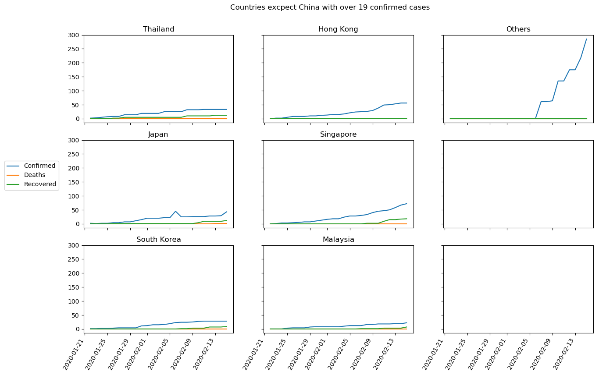
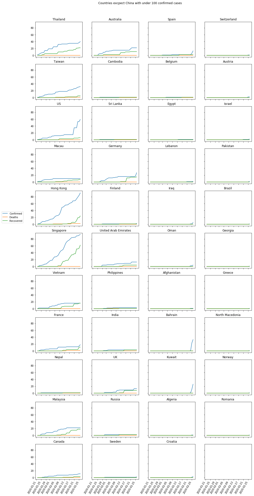

# COVID19

I made this program just for practice. It originally used python and Google Spreadsheets API. I got data from: https://gisanddata.maps.arcgis.com/apps/opsdashboard/index.html?fbclid=IwAR3S1IMXpzD-EfOPqWCDttt96vuDQ77Uddrqhhf-iTRmYKxyOPQlPhsxG14#/bda7594740fd40299423467b48e9ecf6, provided by JHU CSSE.

Now I am gonna use data from github where they update it now twice a day.
Link to [github repository with data](https://github.com/CSSEGISandData/COVID-19).

For previous version where I used Google Spreadsheets data go to [this directory](../previous_version_files).

**Things i plan to do:**
- [x] Did everything I needed to read data from Google Spreadsheets and used data to make some plots (look here: [previous_version_files/README.md](../previous_version_files/README.md)).
- [x] Read data in new way - from github
- [x] Prepare it the same way as in previous version
- [x] Go on with making plots and some analysis

<h2>Here are some plots I made:</h2>

<h3>Time series data for China</h3>

The significant increase (about 15000 cases) in confirmed cases around 13th of February is caused by change in the definition of confirmed case.

<h3>Time series plots for all other countries</h3>

<h3>Absolute growth</h3>

  
   

<h3>Absolute growth</h3>

