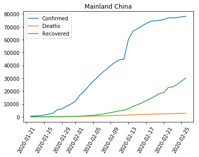
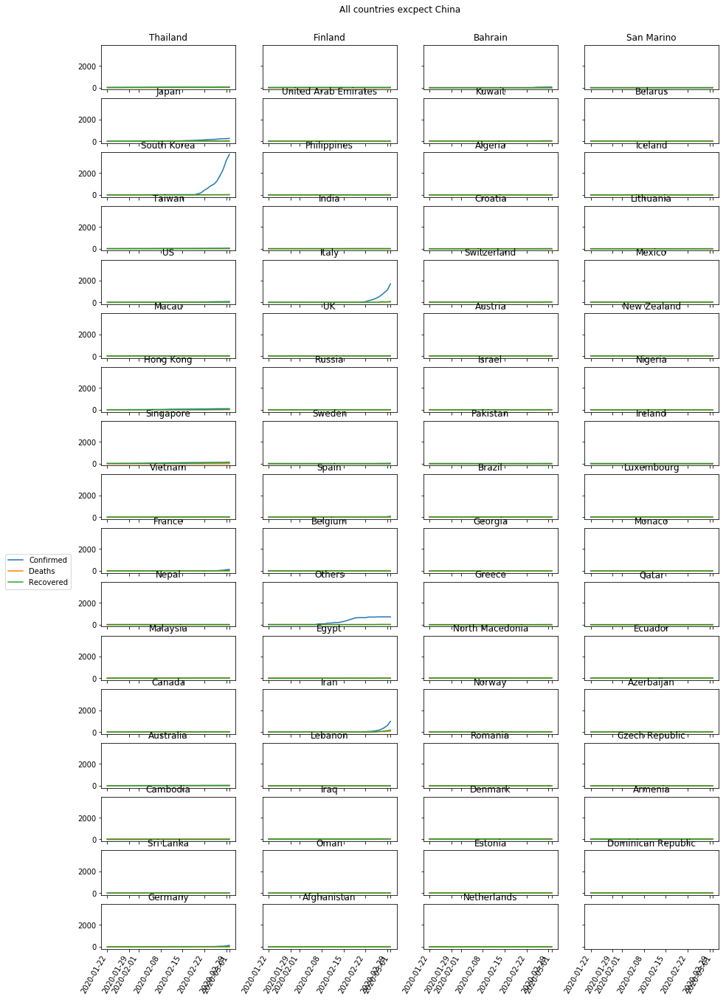

# SARS-CoV-2

I made this program just for practice. It originally used python and Google Spreadsheets API. I got data from: https://gisanddata.maps.arcgis.com/apps/opsdashboard/index.html?fbclid=IwAR3S1IMXpzD-EfOPqWCDttt96vuDQ77Uddrqhhf-iTRmYKxyOPQlPhsxG14#/bda7594740fd40299423467b48e9ecf6, provided by JHU CSSE.
Now it is going to be changed to use data from github where they update it now twice a day.
Link to [I'm an inline-style link with title](https://github.com/CSSEGISandData/COVID-19 "github repository with data").
For previous version where I used Google Spreadsheets data go to directory [I'm a relative reference to a repository file](../previous_version_files).

**Things i plan to do:**
- [x] Did everything I needed to read data from Google Spreadsheets and used data to make some plots (look here: [I'm a relative reference to a repository file](../previous_version_files/README.md)).
- [ ] Read data in new way - from github
- [ ] Prepare it the same way as in previous version
- [ ] Go on with making plots and some analysis

<h2>Here are some plots I made:</h2>

**Time series data for China**

**Time series data for all other countries**

