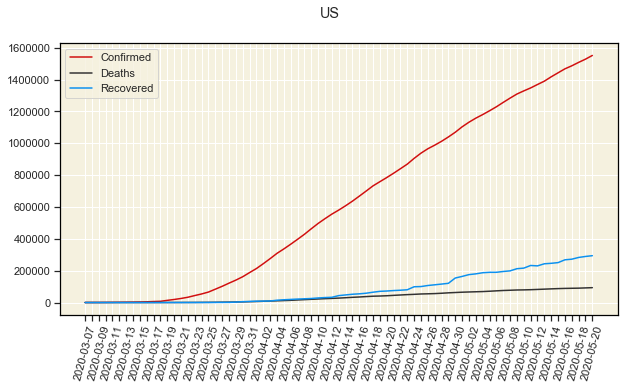
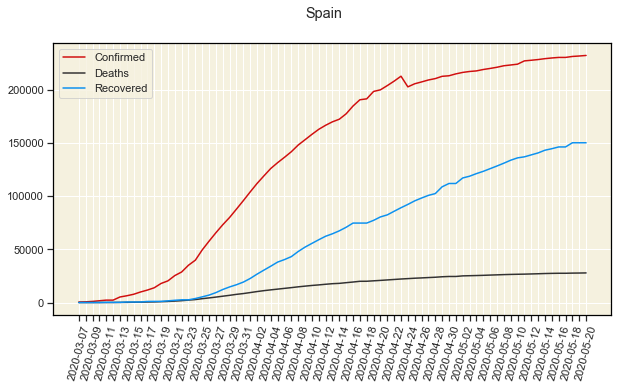
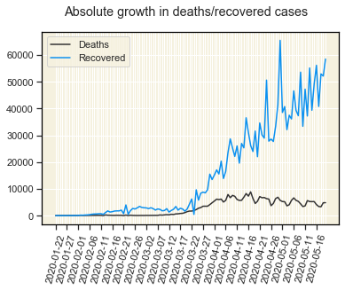

# COVID19

The program is fully automatical. [main.ipynb](../main.ipynb) is a script that you can run all cells at once and get every graph and xls file with latest data possible.

I made this program just for practice. It originally used python and Google Spreadsheets API. I got data from: https://gisanddata.maps.arcgis.com/apps/opsdashboard/index.html?fbclid=IwAR3S1IMXpzD-EfOPqWCDttt96vuDQ77Uddrqhhf-iTRmYKxyOPQlPhsxG14#/bda7594740fd40299423467b48e9ecf6, provided by JHU CSSE.

Now I am using data from github where they update it now once a day.
Link to [github repository with data](https://github.com/CSSEGISandData/COVID-19).

For previous version where I used Google Spreadsheets data go to [this directory](../blob/master/previous_version_files).

**Things I have done:**
- [x] Did everything I needed to read data from Google Spreadsheets and used data to make some graphs **(look [here](../blob/master/previous_version_files/README.md))**.
- [x] Read data from github repository
- [x] Process data using **pandas**
- [x] Automated making graph with number of confirmed/deaths/recovered cases for 2 countries with biggest numbers
- [x] Automated making figure with graphs of countries with most confirmed casese (without 2 countries from point above)
- [x] Automated making graph for absolute growth in number of confirmed and deaths/recovered cases
- [x] Automated making interactive plot using **bookeh (look [here](../blob/master/docs))**
- [x] Automated making graph with number of confirmed cases starting from the day when the country passed 100 confirmed cases (for few chosen countries)
- [x] Automated making graph with number of confirmed cases per million citizens

## Technologies used:
- Python 3
- Jupyter Notebook
- pandas 
- matplotlib
- seaborn
- git
- bookeh

## Here are some graphs I made:

<h3>Time series data for US</h3>

<h3>Time series data for Spain</h3>

<h3>Time series graph for other countries with biggest number of confirmed cases</h3>

<h3>Absolute growth</h3>

 

<h3>Number of confirmed cases by days after passing 100 confirmed cases in country</h3>

<h3>Number of confirmed cases per million citizens in countries</h3>

